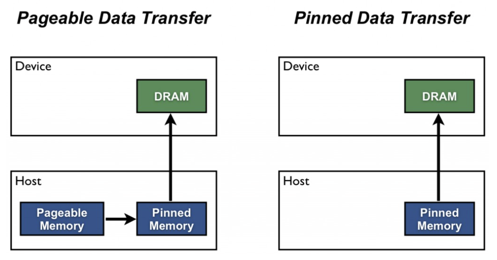

## Optimizations

### Baseline: naive implementation
Global memory access (no shared memory)
With outer subarr len loop and inner stride loop, complexity is O((logn)^2), for an array length of 10E8, it pads to 2^27, 
    num_launches = 27 * (27 + 1) / 2 = 378

    in each launch, launches
    num_threads = pad_size / 2 = 2^26 threads 
    memory_traffic = num_threads × 2 elements × 4Byte = 512 MB read and 512 MB written per launch

so total memory traffic is 512mb * 378 = ~400 GB of total global memory traffic (read plus write) for a 512mb array (2^27 * 4bytes) is obviously not ideal. With H100 memory bandwidth 3.35 TB/s, the memory traffic time itself is 120ms > target 80ms.

As a result, the dominate optimization is reusing data on shared memory.

#### Profile of baseline approach
###### ncu
==PROF== Disconnected from process 11139
[11139] a.out@127.0.0.1
  Device 0, CC 9.0
    bitonic_merge(int *, int, int, int) (16384, 1, 1)x(512, 1, 1), Invocations 300
      Section: Command line profiler metrics
      ---------------------------------------------------------------- ----------- ------- ------- -------
      Metric Name                                                      Metric Unit Minimum Maximum Average
      ---------------------------------------------------------------- ----------- ------- ------- -------
      gpu__compute_memory_throughput.avg.pct_of_peak_sustained_elapsed           %   56.59   72.29   64.43
      sm__warps_active.avg.pct_of_peak_sustained_active                          %   70.30   78.18   73.84
      ---------------------------------------------------------------- ----------- ------- ------- -------

    fill_padding(int *, int, int, int) (52947, 1, 1)x(128, 1, 1), Invocations 1
      Section: Command line profiler metrics
      ---------------------------------------------------------------- ----------- ------- ------- -------
      Metric Name                                                      Metric Unit Minimum Maximum Average
      ---------------------------------------------------------------- ----------- ------- ------- -------
      gpu__compute_memory_throughput.avg.pct_of_peak_sustained_elapsed           %   18.62   18.62   18.62
      sm__warps_active.avg.pct_of_peak_sustained_active                          %    9.65    9.65    9.65
      ---------------------------------------------------------------- ----------- ------- ------- -------

###### grade.py result
Achieved Occupancy: 41.83
Memory Throughput: 41.52
Running NAIVE approach
FUNCTIONAL SUCCESS
Array size         : 100000000
CPU Sort Time (ms) : 14831.478516
GPU Sort Time (ms) : 298.024231
GPU Sort Speed     : 335.543182 million elements per second
PERF PASSING
GPU Sort is  49x faster than CPU !!!
H2D Transfer Time (ms): 42.532639
Kernel Time (ms)      : 123.787903
D2H Transfer Time (ms): 131.703674

Running NAIVE approach
FUNCTIONAL SUCCESS
Array size         : 100000000
CPU Sort Time (ms) : 15024.586914
GPU Sort Time (ms) : 296.452271
GPU Sort Speed     : 337.322418 million elements per second
PERF PASSING
GPU Sort is  50x faster than CPU !!!
H2D Transfer Time (ms): 41.745281
Kernel Time (ms)      : 124.017502
D2H Transfer Time (ms): 130.689468

Running NAIVE approach
FUNCTIONAL SUCCESS
Array size         : 100000000
CPU Sort Time (ms) : 14881.471680
GPU Sort Time (ms) : 296.540955
GPU Sort Speed     : 337.221558 million elements per second
PERF PASSING
GPU Sort is  50x faster than CPU !!!
H2D Transfer Time (ms): 42.335297
Kernel Time (ms)      : 123.914749
D2H Transfer Time (ms): 130.290909

Kernel Time: 123.787903ms, Score: 6.463
Memory Transfer Time: 172.434749ms, Score: 0.696
Million elements per second: 337.584
Total Score: 13.16 pts

### Major optimization: tiling through shared memory
By tiling, tile size T of threads load data to shared memory once and reuse 

#### Host Launch Algorithm
##### Pad array size, allocate and move data to device global memory
Pad array size 100M to nearest power of two, pad_size = 2^27.

##### Decide launch grid and tile size
H100 shared memory is 48KB (software default), 48KB / 4Byte = 12K, tile size is the nearest power of two <= 12K is 8192. Giving per thread block limitation 1024 threads, set threads_per_block = 1024, and blocks_per_grid = pad_size 2^27 / 1024.

##### Launch kernelA for k <= 8192
In k ranges [2, 4, ... N], when k <= 8192, the shared memory can hold all k loops and stride loops with fixed tile size 8192.

##### Launch kernelB for k > 8192

##### Clear device memory

#### Device Kernel A Algorithm
##### Phasing loop loading
Each thread need to load 8192 / 1024 = 8 elements to shared memory, so the phasing loop need 8 loops for 1024 threads to load entire tile data. Each thread load stride is 1024 for memory coalescing.

Sync threads after loading tile data.

##### Loop k and stride
Loop k in [2^1, ... 2^13], inner loop stride in [k/2, k/4... 1], sequentially compare and swap arr[i] with arr[i + stride].

Each thread does 4096 / 1024 = 4 pairs, with stride 1024 (eg: thread[t] works on arr[t], arr[t + 1024], arr[t + 2048] arr[t + 3072], and corresponding arr[i + stride]).

Sync threads after each stride done.

##### Write back to global memory

#### Device Kernel B Algorithm
Each kernel takes in current k for direction, fix tile size = 8192, loop over all strides in [4096, 1] inside kernel. Launch grid: <<<pad_size / TILE, 1024>>>

##### Phasing loop loading
Loop phase in [0, TILE / 1024 - 1]. 
Sync threads.

##### Loop stride and compare
For stride in [4096, 1], each thread compare num_pairs = 4096 / 1024, phase loop: derive i, compare and swap.

Sync threads after each stride done.

##### Write back to global memory

### Memory transfer optimization
#### Profile
###### ncu
==PROF== Disconnected from process 17772
[17772] a.out@127.0.0.1
  Device 0, CC 9.0
    bitonic_merge(int *, int, int, int) (16384, 1, 1)x(512, 1, 1), Invocations 66
      Section: Command line profiler metrics
      ---------------------------------------------------------------- ----------- ------- ------- -------
      Metric Name                                                      Metric Unit Minimum Maximum Average
      ---------------------------------------------------------------- ----------- ------- ------- -------
      gpu__compute_memory_throughput.avg.pct_of_peak_sustained_elapsed           %   56.18   66.77   62.69
      sm__warps_active.avg.pct_of_peak_sustained_active                          %   74.99   78.49   75.62
      ---------------------------------------------------------------- ----------- ------- ------- -------

    bitonic_merge_large_k(int *, int) (2048, 1, 1)x(1024, 1, 1), Invocations 11
      Section: Command line profiler metrics
      ---------------------------------------------------------------- ----------- ------- ------- -------
      Metric Name                                                      Metric Unit Minimum Maximum Average
      ---------------------------------------------------------------- ----------- ------- ------- -------
      gpu__compute_memory_throughput.avg.pct_of_peak_sustained_elapsed           %   30.94   32.90   31.18
      sm__warps_active.avg.pct_of_peak_sustained_active                          %   96.29   96.31   96.30
      ---------------------------------------------------------------- ----------- ------- ------- -------

    bitonic_merge_small_k(int *) (2048, 1, 1)x(1024, 1, 1), Invocations 1
      Section: Command line profiler metrics
      ---------------------------------------------------------------- ----------- ------- ------- -------
      Metric Name                                                      Metric Unit Minimum Maximum Average
      ---------------------------------------------------------------- ----------- ------- ------- -------
      gpu__compute_memory_throughput.avg.pct_of_peak_sustained_elapsed           %   32.77   32.77   32.77
      sm__warps_active.avg.pct_of_peak_sustained_active                          %   49.93   49.93   49.93
      ---------------------------------------------------------------- ----------- ------- ------- -------

    fill_padding(int *, int, int, int) (52947, 1, 1)x(128, 1, 1), Invocations 1
      Section: Command line profiler metrics
      ---------------------------------------------------------------- ----------- ------- ------- -------
      Metric Name                                                      Metric Unit Minimum Maximum Average
      ---------------------------------------------------------------- ----------- ------- ------- -------
      gpu__compute_memory_throughput.avg.pct_of_peak_sustained_elapsed           %   18.63   18.63   18.63
      sm__warps_active.avg.pct_of_peak_sustained_active                          %    9.59    9.59    9.59
      ---------------------------------------------------------------- ----------- ------- ------- -------

###### grade.py
Achieved Occupancy: 57.99
Memory Throughput: 36.27
Running shared memory OPTIMIZATION approach
FUNCTIONAL SUCCESS
Array size         : 100000000
CPU Sort Time (ms) : 15045.066406
GPU Sort Time (ms) : 244.641190
GPU Sort Speed     : 408.761902 million elements per second
PERF PASSING
GPU Sort is  61x faster than CPU !!!
H2D Transfer Time (ms): 41.458496
Kernel Time (ms)      : 73.809219
D2H Transfer Time (ms): 129.373474

Running shared memory OPTIMIZATION approach
FUNCTIONAL SUCCESS
Array size         : 100000000
CPU Sort Time (ms) : 15222.079102
GPU Sort Time (ms) : 248.688278
GPU Sort Speed     : 402.109833 million elements per second
PERF PASSING
GPU Sort is  61x faster than CPU !!!
H2D Transfer Time (ms): 43.206718
Kernel Time (ms)      : 73.821342
D2H Transfer Time (ms): 131.660217

Running shared memory OPTIMIZATION approach
FUNCTIONAL SUCCESS
Array size         : 100000000
CPU Sort Time (ms) : 14999.749023
GPU Sort Time (ms) : 244.944412
GPU Sort Speed     : 408.255890 million elements per second
PERF PASSING
GPU Sort is  61x faster than CPU !!!
H2D Transfer Time (ms): 42.174240
Kernel Time (ms)      : 73.472351
D2H Transfer Time (ms): 129.297821

Kernel Time: 73.472351ms, Score: 10
Memory Transfer Time: 170.83196999999998ms, Score: 0.702
Million elements per second: 409.326
Total Score: 16.7 pts

After kernel shared memory optimization, I got a result with H2D, kernel time looking ok, but D2H takes too much time.

Initially I thought the reason is naive malloc allocating physical pages lazily on every page size device copy to CPU, and there's one OS page fault overhead to allocate physical page. So I tried to replace naive malloc with cudaHostAlloc, using pin memory. The mechanism is it will allocate a locked pin memory on host memory, and device can directly copy to that area which is the time win.

However, using cudaHostAlloc barely changes D2H transfer time. So reasoning through, I realize there's no free lunch, cudaHostAlloc takes similar time allocating memory as naive malloc do, the actual mechanism is that cudaHostAlloc takes as long time as malloc to allocate but once done, device can copy faster, while for pageable memory and malloc, each D2H copy takes longer time, since device need to copy data to a small pinned memory buffer on host, and host need extra memcpy to move data to actual allocated array location, which cudaHostAlloc reduces. [2]

Furthemore, cudaHostAlloc reduces time by overlapping with kernel running, while CPU is idle. [2] There's syncthreads before and after bitonic_sort() in main.cu, so my allocating with cudaHostAlloc in host_to_dev() makes it unable to simultaneously work with GPU, by moving allocation into bitonic_sort() reduced D2H greatly.

cudaHostAlloc reference documentation:
[1] https://docs.nvidia.com/cuda/cuda-runtime-api/group__CUDART__MEMORY.html#group__CUDART__MEMORY_1gb65da58f444e7230d3322b6126bb4902

[2] https://developer.nvidia.com/blog/how-optimize-data-transfers-cuda-cc/

### Other optimizations
##### 1. Data type optimization
arrCpu[i] = rand() % 1000; in main.cu indicates that value inside array ranges in [0, 999], so replacing DTYPE int -> uint16_t / int16_t / short which is reducing each data size from 32bit -> 16bit, halving the data transferred.

##### 2. Move data on register rather than read from global

'''
// before - double load each from global memory

if ((arr[i] < arr[i + stride]) != dir) {
    // swap
    DTYPE tmp = arr[i];
    arr[i] = arr[i + stride];
    arr[i + stride] = tmp;
}

// after - once load from global memory
DTYPE a = arr[i];
DTYPE b = arr[i + stride];
if ((a < b) != dir) {
    arr[i] = b;
    arr[i + stride] = a;
} 

'''

### Bugs

##### 1. Out of bound when pad_size < TILE=8192 with optimized kernels
Initially in optimized 

